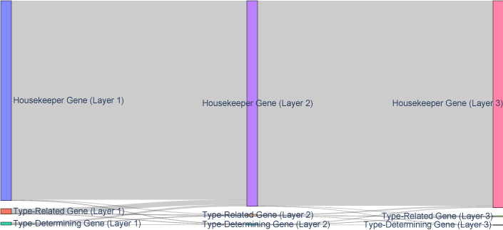

Gene Analysis Through Different Layer
========================================== 

This dataset contains 4,714 cells from the **Red Nucleus** region of the human midbrain, as part of the **Human Brain Cell Atlas**. 
For more details, refer to the `description <https://cellxgene.cziscience.com/e/470565f2-5afc-456a-b617-18e4496c04fd.cxg/>`_. 
It is available for free download in **h5ad** format from the **CELLxGENE** website via this link: `Download Link <https://datasets.cellxgene.cziscience.com/5488ff72-58ed-4f0d-913c-1b6d4d8412b1.h5ad>`_.

Retrieve the hierarchical structure of the data
--------------------------------------------------

.. code-block:: python

    import requests
    import anndata
    import CellScope
    from scipy.sparse import issparse
    url = "https://datasets.cellxgene.cziscience.com/5488ff72-58ed-4f0d-913c-1b6d4d8412b1.h5ad"
    file_path = "Siletti-1.h5ad"
    response = requests.get(url, stream=True)
    if response.status_code == 200:
        with open(file_path, "wb") as f:
            for chunk in response.iter_content(chunk_size=8192):
                f.write(chunk)
    adata = anndata.read_h5ad("Siletti-1.h5ad")
    fea_raw = adata.X
    cell_types = adata.obs['cell_type']
    label = np.array(cell_types)
    fea_raw,fea_log,fea = CellScope.cs.Normalization(fea_raw)
    fea_Fitting_1, Signal_Space, Center_index = CellScope.cs.Manifold_Fitting_1(fea)
    if issparse(fea_Fitting_1):
        fea_Fitting_1 = fea_Fitting_1.toarray()
    fea_Fitting_2, fitting_index, index_after_outlier_removal = CellScope.cs.Manifold_Fitting_2(fea_Fitting_1)
    T_all_1 = CellScope.cs.GraphCluster(fea_Fitting_1)
    T_all_2 = CellScope.cs.GraphCluster(fea_Fitting_2)
    Y_1, Title_1, Y_all, Title_all, index_1, index_all, step0, step1 = CellScope.ts.generate_tree_structured(fea_Fitting_1, T_all_1, step0 = None, step1 = 8)
    CellScope.ts.visualize_tree_structured(Y_initial, label_step0, Y_1, Title_1, Y_all, Title_all, index_1, index_all, step0, step1, T_all_1, save_fig = True, save_path='Res')

Define the hierarchical structure to be considered
----------------------------------------------------------------------------------------------------

The considered hierarchical structure is: from **Cluster 5** to **Cluster 51** and **Cluster 52**, then to **Cluster 521** and **Cluster 522**.

.. code-block:: python
    layer = [index_1[5],np.setdiff1d(range(T_all_1.shape[0]),index_1[5]),index_all[0],index_all[1],index_all[4],index_all[5]]

Calculate the Wasserstein distance between nodes at the same layer
----------------------------------------------------------------------------------------------------

Based on the calculated Wasserstein distance, genes are categorized into **Housekeeper Gene**, **Type-Related Gene**, and **Type-Determining Gene**. 
Moreover, depending on their decisive roles at each layer, 
they are further divided into distinct **gene type conversion flows**.

.. code-block:: python
    
    Res, label, label_str, flow_labels = CellScope.ga.Gene_Analysis(fea_log,layer)

Count the number of each gene type at each layer.
--------------------------------------------------

.. code-block:: python
    
    gene_counts = CellScope.ga.plot_sankey(label_str,save_fig=True, save_path='sankey_diagram.png')
    gene_counts

=====================  =======  =======  =======
Gene Type              Layer 1  Layer 2  Layer 3
=====================  =======  =======  =======
Housekeeper Gene       56844    58480    58879
Type-Related Gene      1579     436      307
Type-Determining Gene  813      320      50
=====================  =======  =======  =======

Sankey diagram of gene type changes between layers

We recommend viewing the Sankey diagram directly in Python. 
We used Plotly to create an interactive chart, making it easier for you to explore and analyze in detail.
